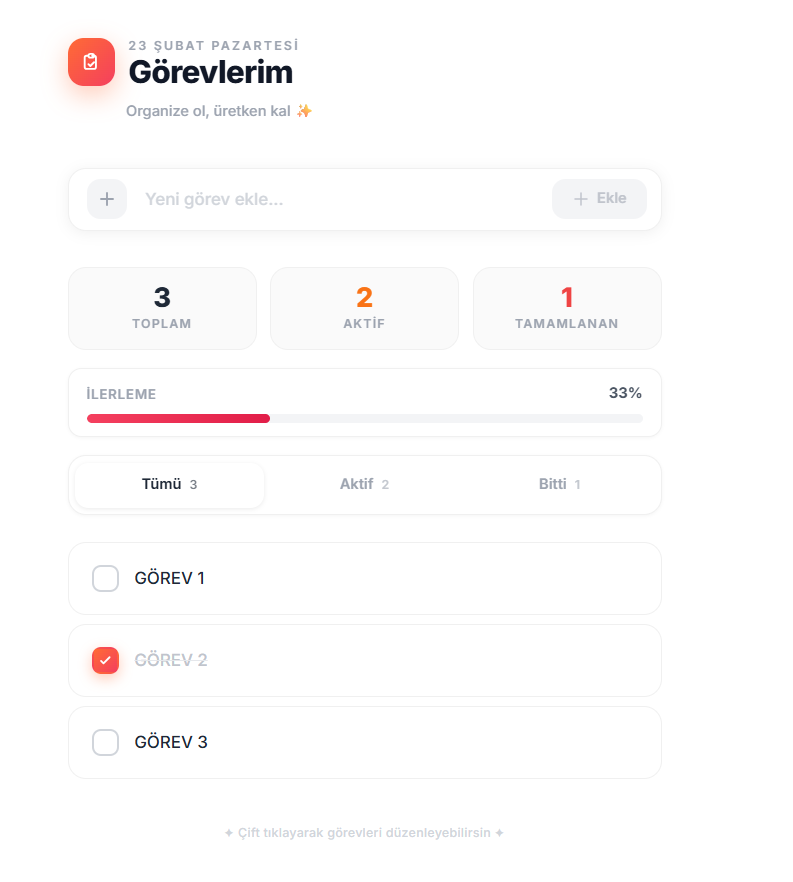
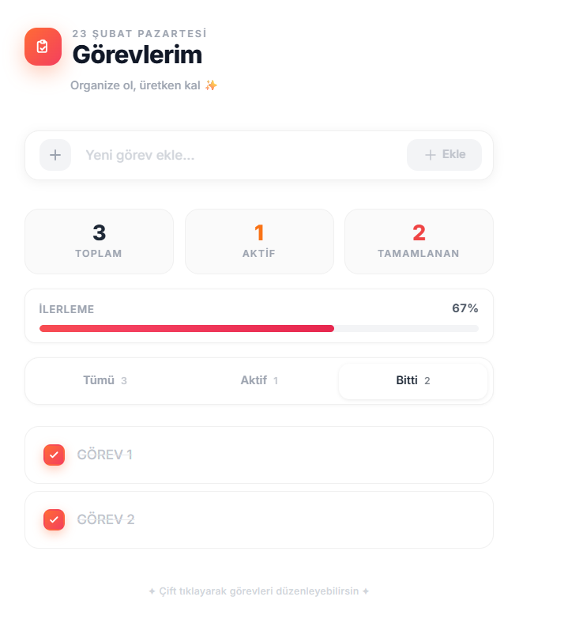

# Görev Yöneticisi (Task Manager)

Modern ve şık arayüze sahip, tam CRUD destekli bir görev yönetim uygulaması.





## Özellikler

- Görev ekleme, silme, düzenleme ve tamamlama
- Görevleri filtreleme (Tümü / Aktif / Bitti)
- İlerleme çubuğu ile tamamlanma yüzdesi takibi
- Anlık istatistik kartları (Toplam / Aktif / Tamamlanan)
- Çift tıklayarak hızlı düzenleme
- Animasyonlu bildirimler (toast)
- Tamamen responsive tasarım

## Teknolojiler

### Backend
- **Node.js** + **Express 5**
- **MongoDB** + **Mongoose**
- **dotenv** — ortam değişkenleri
- **cors** — cross-origin istekleri

### Frontend
- **HTML / CSS / JavaScript** (framework yok)
- **Tailwind CSS** (CDN)
- **Fetch API** ile RESTful iletişim

## Kurulum

### 1. Projeyi klonla

```bash
git clone https://github.com/KULLANICI_ADIN/task-manager-app.git
cd task-manager-app
```

### 2. Backend bağımlılıklarını yükle

```bash
cd backend
npm install
```

### 3. Ortam değişkenlerini ayarla

`backend` klasöründe `.env` dosyası oluştur:

```env
DATABASE_URL=mongodb+srv://<kullanici>:<sifre>@cluster.mongodb.net/task-manager?retryWrites=true&w=majority
PORT=5000
```

> MongoDB Atlas veya yerel MongoDB bağlantı adresini buraya yaz.

### 4. Sunucuyu başlat

```bash
# Geliştirme modu (nodemon ile otomatik yeniden başlatma)
npm run dev

# veya doğrudan
node app.js
```

### 5. Tarayıcıda aç

```
http://localhost:5000
```

Frontend dosyaları Express tarafından statik olarak sunulur, ayrı bir sunucuya gerek yoktur.

## API Endpoints

| Yöntem   | Endpoint              | Açıklama             |
|----------|-----------------------|----------------------|
| `GET`    | `/api/v1/tasks`       | Tüm görevleri getir  |
| `POST`   | `/api/v1/tasks`       | Yeni görev ekle      |
| `PATCH`  | `/api/v1/tasks/:id`   | Görevi güncelle      |
| `DELETE` | `/api/v1/tasks/:id`   | Görevi sil           |

## Proje Yapısı

```
task-manager-app/
├── backend/
│   ├── app.js                 # Express sunucu
│   ├── package.json
│   ├── controller/
│   │   └── tasksController.js # CRUD işlemleri
│   ├── db/
│   │   └── connectDB.js       # MongoDB bağlantısı
│   ├── models/
│   │   └── taskModel.js       # Mongoose şeması
│   └── routes/
│       └── tasks.js           # API rotaları
├── frontend/
│   ├── index.html             # Ana sayfa
│   ├── style.css              # Özel stiller
│   └── app.js                 # Tüm JS mantığı
├── images/
│   ├── 1.png
│   └── 2.png
└── README.md
```

## Lisans

MIT